# Namaste-India

## Milestone Project 1: Static Front-End Website 

 
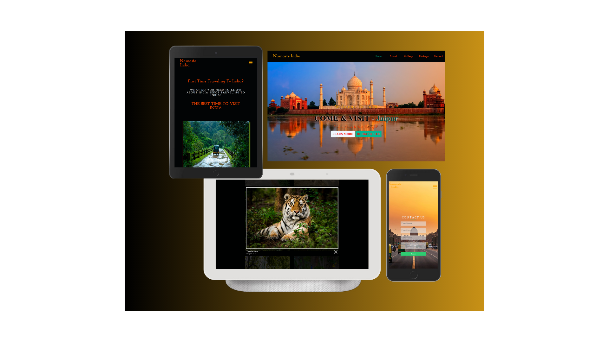

Namste India Is for people who whats know about The India before they travel. 

 

This is my Milestone project 1 submission for Code Institute’s Diploma in Web Application Development course. My Website features six pages and is built using languages that I have learnt including, HTML, CSS, JAVAscript, jquery and Bootstrap.  

 

## Live Project 

 

(Link to the project here)
https://killol14.github.io/Namaste-India/

 

## Repository  

(Project repository here)  
https://github.com/Killol14/Nmaste-India
 

## Table of Contents  

* User Experience

1.User stories

* Wireframes 

* Design  

1.Font Style  

2.Colour Scheme  

3.Images and Icons  

* Structure  

1.Navigation Bar  

2.Carousel card and JsFlipster  

3.Hyperlinks  

4.Map  

5.LightHouse Images

6.Social Media Links (Footer)  

* Features  

1.Current Features 

* Technologies Used  

1.Languages used  

2.Frameworks and Library Programs  

* Testing  

* Deployment  

1. GitHub Pages  

* Credits  

1.Code  

2.Media  

3.Content  

4.Acknowledgements  

* Summary  
---------------------------------------------------------------------------------------------------

## User Experience

* User Stories

Pspective visitors 

I created this website for families and potential visitors and first Time Travelling to TheIndia, as I couldn’t find a website that contained the information for the firsttime Travelling to india and wants know before travelling to the India. 

I also believe that visitors who wish to ask more questions about the India befor they travel as I have created a contact form to submit with any questions and also I have created a Package Guide form where they can find out estimated price for travelling to India.

## Wireframes  

### Home Page

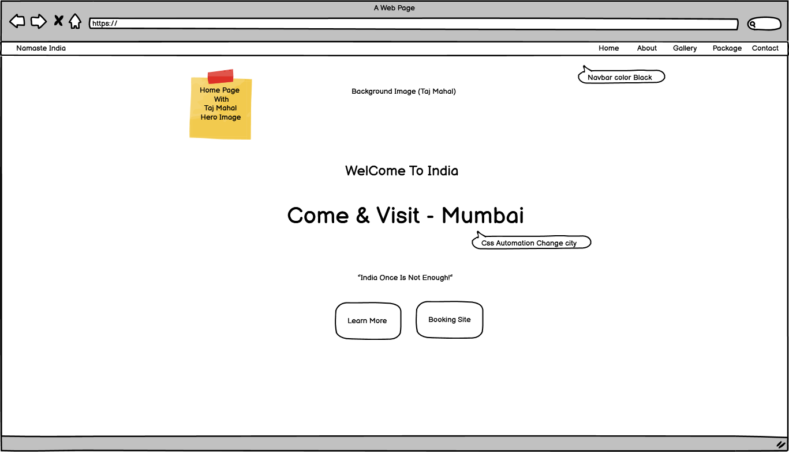

### About Page

### Gallery Page

### Package Page

### Contact Page

### Ipad View

###Phone View

## Design 

For the Main title page of The Namste India website, (H1) I used "Josefin Slabas" the main font. This is a clear and simplistic font enabling Viewers of the website see clearly the topic of the website.  I also Used Same Font "Josefin Slab" throughout the wwebsite as seems like its more related font with Indian culture.

 

## Colour Scheme  

Used RGB throughout.  

I chose this colour scheme, as the website is based around Nature, the Green and beige colour scheme match with the nature tones of the topic of the website.  

* Black
* Olive
* FF0000
* FF4500
* CFB21F
* 9ACD32

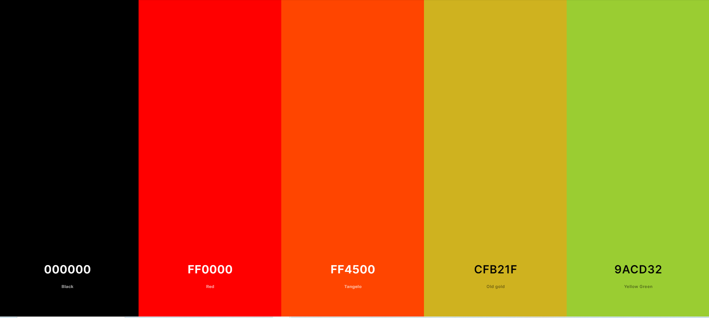

## Images  

As this website is based on an area of Natural Beauty, I have included images of the park in order to show the diverse aesthetic of the park.  

The front page has carousel images in order to give a snapshot of the park.  

I have also added extra pictures to each subheading on the website to give a visualization of the attractions situated in the park.  

The website contains border radius throughout for the images to make them more striking and visually appealing 

I have also added a link to a gallery section, in order to give the reader more of an idea of the beauty of the park.  

 

## Icons  

I used the social media on the footer Icons, which are located on the footer from, Font Awesome.  

 

## Structure  

 

### Navigation Bar  

The navigation bar is Static and is sticky, so the user can refer back to the links at the top at any point.  

I have added the navigation bar on the all other page so its easy to navigate.

### Carousel card and JsFlipster

For the carouse card image for gallery I have used the Bootstrap 4.5 and 7 ,
for the Jsflipster I have Copyed the link and some code from one of the YouTube Guide Video.

### Hyperlinks  

I have included Hyperlinks on the webpage to allow the user to go straight to different websites where external companies provide more details about the events/restaurants/Opening times to get more information.  

### Map  

I have included a Map, for information on location and also to show the scale of the park.  
Map is Also created with the javascript.

 

#### LightHouse Images

gallery2 Is created with LightHouse-plus-Jquery.js 

 

### Social Media Links (Footer) 

This includes the icons which take the user to the relevant social media page  

This code was sourced from Code Institute’s Bootstrap CV project 

 

 ## Features  

 

### Current Features  

I have created a website that is fully responsive on all screen sizes eg Tablet Mobile Laptop, by using the Bootsrap grid system. This allows the texts and images to translate properly on these devices.  

 

### Interactive Elements  

I have included a hover function on the gallery tab to enable users to zoom in on the pictures.  

I have also added a Map to the bottom page of the website in order for uses to see the scale of the park and the different car parks/entrances and location.  

 

## Technologies Used  

### Languages used 

* HTML 5 and CSS 3  

### Frameworks and Library Programs 

Bootstrap 5  

I used Bootstrap for the Navigation Bar and Carousel 

 

####  Google Fonts 

Two fonts Ubantu and Monserrat Bold, were imported from google font.  

 

####  Font awesome 

I used the social media icons from font awesome  

 

####  Git  

Git was used as version control in terminal  

 

####  Github 

Github was used to create and store the project repository  

 

####  Gitpod  

Gitpod was used to create my files and where I wrote the code.  

 

* JQuery  

JQuery came with Bootstrap to make the Nav bar responsive  

 

### Testing 

### Html, css and LightHouse Testing Reports
----------
* HTML Validator Reports 

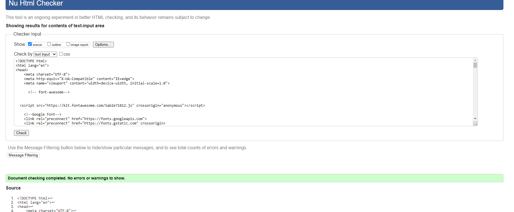 
-----
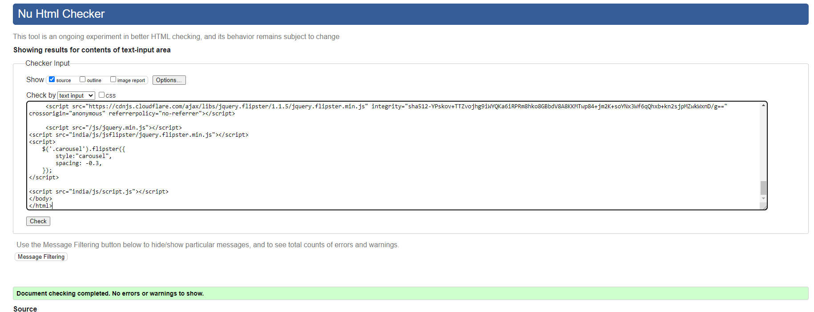 
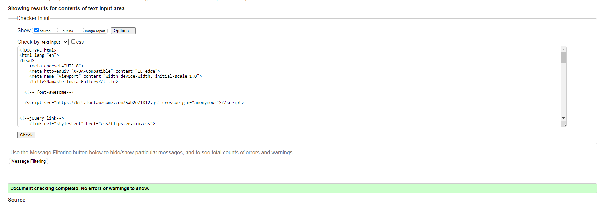 
-----
 
----------
* CSS Validator Reports

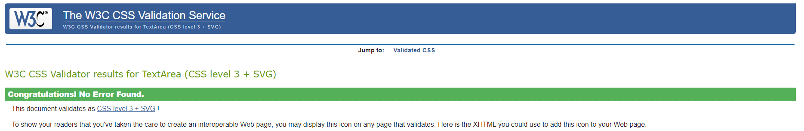 
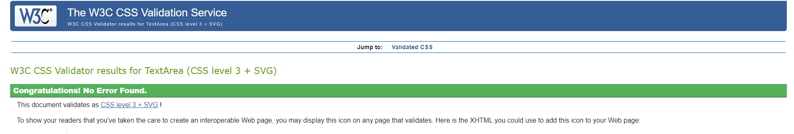 
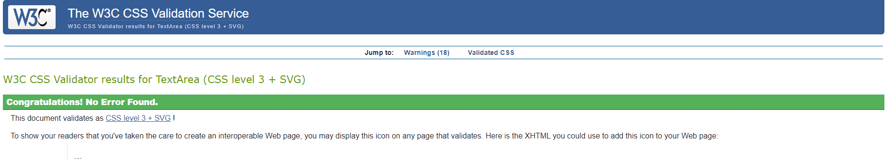 
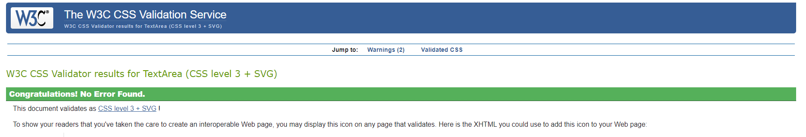 
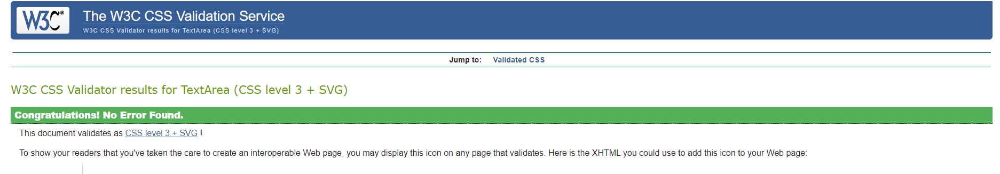 
----------

* JavaScript Validator Reports

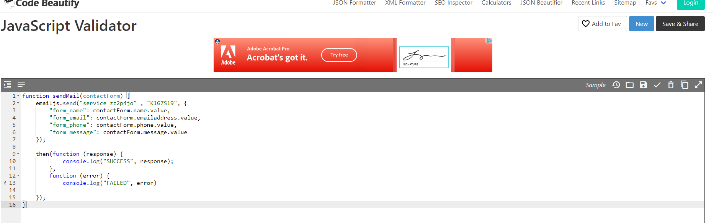 

* LightHouse Performance
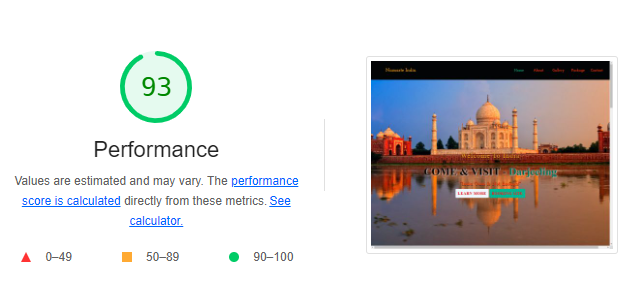 
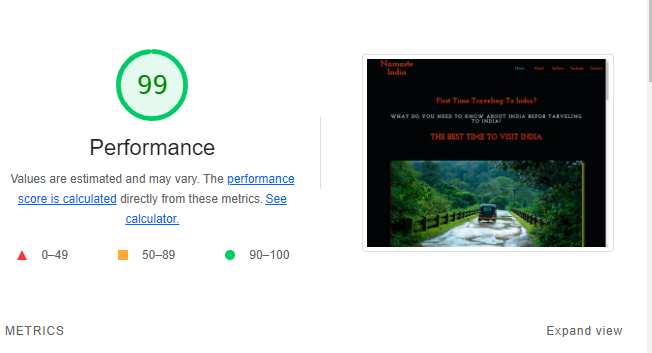 
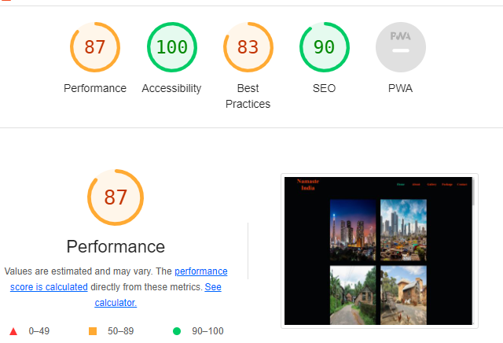 
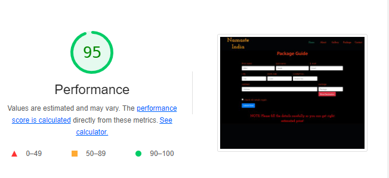 
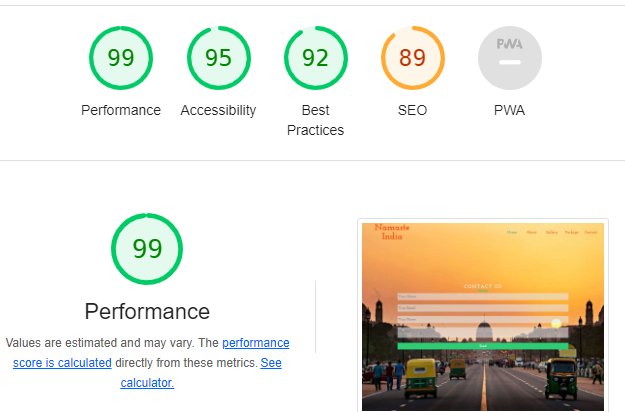 
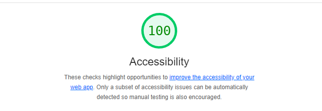 

-----------------------------------------------------------------------------------------------------
## Deployment  

### How this Project was Deployed

This project was deployed to GitHub pages via the following steps:

1.Log into GitHub.![Link to Github] (https://github.com/github)
2.From the list of Repositories, select (Killol14/Namaste-India.)
3.From the Repositories sub-headings, select "Settings".
4.Under "Options", the first category of settings, scroll down to the GitHub Pages section.
5.From the dropdown list under the "Source" heading, select "master".
6.A second drop-down menu that appears should remain as the default value, "/root".
7.Press Save.
8.On Page refresh, scroll back down to the GitHub Pages section, and the link to the deployed site will be available in a green sub-section with a tick icon next to it.

As this project was developed on the master branch, all changes made to the repository are immediately reflected in the deployed project.

### How to Run this Project in your Browser

1.Install the Google Chrome or Firefox browser.
2.Install the applicable GitPod Browser Extensions for your chosen browser.
3.Create a GitHub account.
4.Log in to Gitpod using your GitHub account.
5.Visit Hard Driver's GitHub Repository.
6.Open the repository in Gitpod:
* Click the green "Gitpod" icon at the top of the Repository, or
* Click this link.
7.A new workspace will open with the current state of the master branch. Any changes made to the master branch after this point will not be automatically updated in your Gitpod Workspace.

### How to Run this Project Locally
--------------------------------------------------
##### Cloning the Repository

1.Visit Hard Driver's GitHub Repository.
2.Click the "Code" dropdown box above the repository's file explorer.
3.Under the "Clone" heading, click the "HTTPS" sub-heading.
4.Click the clipboard icon, or manually copy the text presented: (https://github.com/Killol14/Namaste-India.git)
5.Open your preferred IDE (VSCode, Atom, PyCharm, etc).
6.Ensure your IDE has support for Git, or has the relevant Git extension.
7.Open the terminal, and create a directory where you would like the Repository to be stored.
8.Type git clone and paste the previously copied text (https://https://github.com/Killol14/Namaste-India.git) and press enter.
9.The Repository will then be cloned to your selected directory.

### Manually Downloading the Repository

1.Visit Hard Driver's GitHub Repository.
2.Click the "Code" dropdown box above the repository's file explorer.
3.Click the "Download ZIP" option; this will download a copy of the selected branch's repository as a zip file.
4.Locate the ZIP file downloaded to your computer, and extract the ZIP to a designated folder which you would like the repository to be stored.

### Opening the Repository

1.Open your preferred IDE (VSCode, Atom, PyCharm, etc).
2.Navigate to the chosen directory where the Repository was Cloned/Extracted.
3.You will now have offline access to the contents of the project.
 

## Summary 

This website was created as, I noticed when researching ideas for this project, that there was no specific website dedicated to the park. Only the pages on the Birmingham City Council Website were the only information I could find; however, this was just text and no pictures and not overly informative.  

I believe I have a created a website that shows the natural beauty of the park, with stunning visual imagery and links to activities, nature and restaurants.  

 

## Credits  

 

Credit goes to Bootstrap 5 and Shutterstock  
Navigation Bar and carasol are used by Bootstrap 
Main Images from Shutterstock

##### Acknowledgements

 

With thanks to Ronan McCelland,mentor, and Ben Smith, tutor who helped me develop this idea

 

Thank you to the code institute city of Bristol college for help and support.  

 ReadMe file structure, with credit to the former student, milestone 1 Row Gallery Website

This website is purely fictious and not for public consumption.  

 

 

 

 

 

 

 

 

 

 

 

 

 

 

 

 

[def]: https://github.com/github
[def2]: images/LightHouse%20Performance.png
[def3]: images/READMEimg/Home.png
